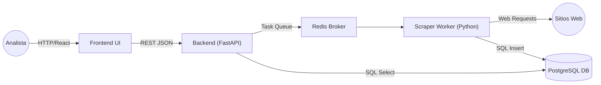
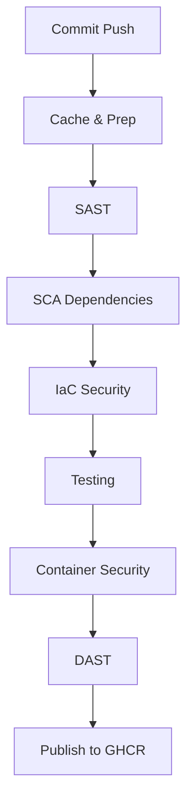

<<<<<<< HEAD
# 🟢 Proyecto Centinela 🛡️

**Autor:** Mauricio Vergara  
Pipeline DevSecOps de ciclo completo para una plataforma contenerizada de análisis de desinformación (OSINT).  
El enfoque principal es la automatización y aseguramiento de todo el ciclo de vida de la aplicación (CI/CD/CS) integrando seguridad en cada fase (Shift-Left Security) con herramientas FOSS.
=======
# 🛡️ CENTINELA
**Plataforma de Análisis Forense y Detección de Desinformación**
*Cloud Computing | Ciberseguridad | DevSecOps | Grupo 3 – UNIMINUTO*
>>>>>>> feature/pipeline-optimization

---

## 🧩 Resumen Ejecutivo

Centinela es una plataforma modular basada en microservicios diseñada para la detección, clasificación y análisis forense de desinformación (Fake News) usando técnicas de scraping, heurística de texto y flujos DevSecOps de seguridad continua.

<<<<<<< HEAD
| Componente | Tecnología | Función | URL / Puerto |
|------------|------------|--------|--------------|
| Frontend | React | Interfaz de usuario | http://localhost:3000 |
| Backend | FastAPI | API que gestiona peticiones | http://localhost:8000 |
| Worker | Python | Scraper que procesa trabajos en cola | - |
| Cola de Mensajes | Redis | Comunicación asíncrona entre API y Worker | - |
| Base de Datos | PostgreSQL | Almacena resultados del scraping | - |
| Contenerización | Docker / Docker Compose | Orquestación local de todos los servicios | - |
=======
Esta plataforma integra:

*   Microservicios aislados
*   Contenedores Docker
*   FastAPI como API Gateway
*   Scraping asíncrono con Workers
*   Persistencia forense en PostgreSQL
*   Pipeline CI/CD seguro (Shift-Left Security)
*   Dashboard en React + Tailwind con visualización SAST, sentimiento y riesgo
>>>>>>> feature/pipeline-optimization

---

## 🏗️ Arquitectura del Sistema

<<<<<<< HEAD
**Archivo principal:** `.github/workflows/ci-cd.yml`  
Integra seguridad en cada fase del ciclo de vida del software.

### 🔹 Fase 1: Plan
- Modelado de amenazas: OWASP Threat Dragon, STRIDE

### 🔹 Fase 2: Code (Seguridad Estática)
- **Pre-commit Hooks:**
  - `gitleaks` → Detecta secretos y claves API
  - `black` → Formato Python consistente
  - `fix-end-of-files / trailing-whitespace` → Limpieza de código
- **SAST (Análisis Estático):**
  - `flake8` → Errores y estilo
  - `bandit` → Vulnerabilidades comunes en Python
  - `semgrep` → Patrones de código complejos
- **SCA (Dependencias):** `trivy fs` → Detecta CVEs
- **IaC Scan:** `checkov` → Escaneo de Terraform

### 🔹 Fase 3: Build (Seguridad de Imágenes)
- Construcción: Docker de los 3 microservicios
- Escaneo: `trivy image` detecta HIGH/CRITICAL y bloquea el pipeline
- Registro Temporal: GHCR (GitHub Container Registry) con la `run_id`

### 🔹 Fase 4: Test (Seguridad Dinámica)
- Unit & Smoke Tests: `pytest` para API y frontend
- DAST: OWASP ZAP analiza frontend (`http://frontend:80`)
- Quality Gates: Falla el pipeline si:
  - `pytest` falla
  - `trivy` detecta CVEs críticos
  - ZAP detecta vulnerabilidades críticas

### 🔹 Fase 5 & 6: Release, Deploy & Monitor
- Publicación: Las imágenes validadas se publican en:
  - GitHub Container Registry (GHCR) con tag `:latest`
  - Docker Hub con tag `:latest`
- Deploy (Simulado): Job `deploy-to-production` simula la conexión SSH a un VPS y la actualización con `docker compose pull` y `docker compose up -d`.
- Monitoreo: Opcional, Falco (seguridad runtime) + stack PLG (Promtail, Loki, Grafana) para logs.
=======
El sistema se compone de 5 servicios totalmente desacoplados:



### Descripción de cada componente

| Componente     | Tecnología        | Función                                                     |
| :------------- | :---------------- | :---------------------------------------------------------- |
| **Frontend**   | React + Tailwind  | UI para búsquedas, dashboard y reportes                     |
| **Backend API**| FastAPI           | Endpoint seguro, validación de entradas, guarda registros   |
| **Broker**     | Redis Queue       | Orquestra trabajos asíncronos y evita bloqueos              |
| **Scraper Worker** | Python            | Extrae artículos, limpia HTML, clasifica y asigna riesgo/sentimiento |
| **Base de Datos**  | PostgreSQL        | Persistencia forense inmutable                              |
>>>>>>> feature/pipeline-optimization

---

## 🚀 Pipeline DevSecOps (CI/CD)

<<<<<<< HEAD
Este método es para desarrolladores que quieren modificar el código fuente. Utiliza:

```
docker-compose up --build
```

**Requisitos:**
- Git
- Docker & Docker Compose v2+
=======
La plataforma implementa un pipeline de seguridad integral basado en GitHub Actions, estructurado bajo el modelo Shift-Left Security.
>>>>>>> feature/pipeline-optimization

### Diagrama del Pipeline

<<<<<<< HEAD
```
git clone https://github.com/MauricioVergaraG/proyecto-centinela.git
cd proyecto-centinela
```
=======


### Etapas del Pipeline

| Etapa              | Herramientas                    | Objetivo                                           |
| :----------------- | :------------------------------ | :------------------------------------------------- |
| **Cache & Prep**   | GitHub Cache                    | Optimización de tiempos de build                   |
| **SAST**           | Black, Flake8, Bandit, Semgrep  | Análisis estático, estilo y vulnerabilidades lógicas |
| **SCA**            | Trivy Filesystem                | CVEs en dependencias (pip)                         |
| **IaC Security**   | Checkov                         | Evaluación de Dockerfiles/Terraform                |
| **Testing**        | Pytest                          | Pruebas unitarias, smoke y validación lógica       |
| **Container Security** | Trivy Image                     | Escaneo de imágenes construidas                    |
| **DAST**           | OWASP ZAP                       | Ataque dinámico contra la API                      |
| **Registry**       | GHCR.io                         | Publicación segura e inmutable                     |

---

## 📦 Despliegue en Producción

Usando Docker Compose + imágenes de GHCR.io firmadas.

### 1. Requisitos
*   Docker 24+
*   Docker Compose V2
*   Acceso a internet

### 2. Archivo `docker-compose.prod.yml`

```yaml
version: '3.8'

services:
  frontend:
    image: ghcr.io/mauriciovergarag/proyecto-centinela/frontend:latest
    ports: ["80:80"]
    restart: always

  api:
    image: ghcr.io/mauriciovergarag/proyecto-centinela/api:latest
    environment:
      - DATABASE_URL=postgresql://user:pass@db:5432/centinela
      - REDIS_HOST=redis
    depends_on: [db, redis]

  scraper:
    image: ghcr.io/mauriciovergarag/proyecto-centinela/scraper:latest
    environment:
      - DATABASE_URL=postgresql://user:pass@db:5432/centinela
      - REDIS_HOST=redis
    depends_on: [api]

  db:
    image: postgres:15-alpine
    environment:
      POSTGRES_USER: user
      POSTGRES_PASSWORD: pass
      POSTGRES_DB: centinela
    volumes:
      - postgres_data:/var/lib/postgresql/data

  redis:
    image: redis:7-alpine

volumes:
  postgres_data:
```

### 3. Ejecutar despliegue

```bash
docker compose -f docker-compose.prod.yml pull
docker compose -f docker-compose.prod.yml up -d
```

---

## 💻 Ejecución Local (Desarrollo)

1.  **Clonar el repositorio**
    ```bash
    git clone https://github.com/MauricioVergaraG/proyecto-centinela.git
    ```
>>>>>>> feature/pipeline-optimization

2.  **Construcción local**
    ```bash
    docker compose up -d --build
    ```

<<<<<<< HEAD
```
# .env
NEWS_API_KEY=tu-clave-secreta-de-newsapi

# Variables para la Base de Datos (puedes dejarlas así)
POSTGRES_USER=centinela
POSTGRES_PASSWORD=supersecretpassword
POSTGRES_DB=centineladb
```
=======
3.  **Accesos**
    *   **Frontend:** `http://localhost:3000`
    *   **API Docs (Swagger):** `http://localhost:8000/docs`
>>>>>>> feature/pipeline-optimization

---

<<<<<<< HEAD
```
docker-compose up --build
```

**Acceder a los servicios:**
- Frontend (App): http://localhost:3000
- Backend (API Docs): http://localhost:8000/docs

---

## 4. 📦 Cómo Consumir las Imágenes (Usuario/Producción)

Este método es para usuarios o para un servidor de producción. No construye nada localmente, sino que descarga y consume las imágenes públicas que el pipeline ya verificó y publicó en Docker Hub.

**Requisitos:**
- Docker & Docker Compose v2+

**Pasos:**

1. Crear un directorio de trabajo:

```
mkdir centinela-prod
cd centinela-prod
```

2. Configurar variables de entorno:  
Crear un archivo `.env` dentro de `centinela-prod` (el mismo que en desarrollo).

```
# .env
NEWS_API_KEY=tu-clave-secreta-de-newsapi
POSTGRES_USER=centinela
POSTGRES_PASSWORD=supersecretpassword
POSTGRES_DB=centineladb
```

3. Crear archivo `docker-compose.prod.yml`:

```
=======
## 🔍 Módulo de Análisis (Scraper + Heurística)

El motor de análisis aplica:

### 1. Limpieza y normalización
*   Eliminación de HTML
*   Decodificación de entidades
*   Tokenización

### 2. Análisis de riesgo
Se evalúan:
*   Porcentaje de palabras alarmistas
*   Presencia de MAYÚSCULAS excesivas
*   Frecuencia de términos manipulativos
*   Ausencia de fuentes verificables
*   Longitud irregular

La clasificación resultante puede ser:

| Nivel       | Criterio                          |
| :---------- | :-------------------------------- |
| **High Risk**   | Señales severas de manipulación     |
| **Medium Risk** | Inconsistencias moderadas         |
| **Low Risk**    | Información estable y verificable |

### 3. Análisis de sentimiento
Se asignan:
*   Positivo
*   Neutral
*   Negativo

---

## 📊 Dashboard de Análisis (Frontend)
Incluye:
*   Métricas agregadas
*   Sentimiento promedio
*   Clasificación de riesgo
*   Conteo total de artículos
*   Lista detallada de artículos
*   Enlaces directos a las fuentes originales

---

## 🐳 Consumo desde Docker Hub (Despliegue Rápido)
Las imágenes oficiales del proyecto están certificadas y disponibles públicamente en Docker Hub. No es necesario clonar el código fuente para desplegar la solución en producción.

| Servicio         | Repositorio Docker Hub                  |
| :--------------- | :-------------------------------------- |
| **Frontend**     | `mauriciovergara/centinela-frontend`    |
| **API Backend**  | `mauriciovergara/centinela-api`         |
| **Scraper Worker** | `mauriciovergara/centinela-scraper`     |

### Cómo desplegar en Producción
Cree un archivo `docker-compose.prod.yml` en su servidor con el siguiente contenido para consumir la última versión estable:

```yaml
>>>>>>> feature/pipeline-optimization
version: '3.8'

services:
  frontend:
    image: mauriciovergara/centinela-frontend:latest
<<<<<<< HEAD
    ports:
      - "3000:80"
    depends_on:
      - api

  api:
    image: mauriciovergara/centinela-api:latest
    ports:
      - "8000:8000"
    env_file: .env
    depends_on:
      - db
      - redis

  scraper:
    image: mauriciovergara/centinela-scraper:latest
    env_file: .env
    depends_on:
      - db
      - redis

  redis:
    image: redis:7-alpine

  db:
    image: postgres:15-alpine
    volumes:
      - postgres_data:/var/lib/postgresql/data
    env_file: .env
=======
    ports: ["80:80"] # La app estará disponible en el puerto 80
    restart: always
    depends_on: [api]

  api:
    image: mauriciovergara/centinela-api:latest
    environment:
      - DATABASE_URL=postgresql://user:pass@db:5432/centinela
      - REDIS_HOST=redis
    depends_on: [db, redis]

  scraper:
    image: mauriciovergara/centinela-scraper:latest
    environment:
      - DATABASE_URL=postgresql://user:pass@db:5432/centinela
      - REDIS_HOST=redis
    depends_on: [api]

  db:
    image: postgres:15-alpine
    environment:
      POSTGRES_USER: user
      POSTGRES_PASSWORD: pass
      POSTGRES_DB: centinela
    volumes: [postgres_data:/var/lib/postgresql/data]

  redis:
    image: redis:7-alpine
>>>>>>> feature/pipeline-optimization

volumes:
  postgres_data:
```

<<<<<<< HEAD
4. Levantar la aplicación:

```
# 1. Descargar todas las imágenes de Docker Hub
docker-compose -f docker-compose.prod.yml pull

# 2. Iniciar todos los contenedores en segundo plano
docker-compose -f docker-compose.prod.yml up -d
```

**Acceder a los servicios:**
- Frontend (App): http://localhost:3000
- Backend (API Docs): http://localhost:8000/docs

=======
### Ejecutar Despliegue
Ejecute los siguientes comandos en la misma carpeta donde creó el archivo:

```bash
# 1. Descargar las últimas imágenes verificadas desde Docker Hub
docker compose -f docker-compose.prod.yml pull

# 2. Levantar el sistema en segundo plano
docker compose -f docker-compose.prod.yml up -d
```
Una vez iniciado, acceda a `http://localhost` (o la IP pública de su servidor).

---

## 🛡️ Evidencia de Seguridad
Automáticamente generada en GitHub Actions:
*   `trivy-reports.zip`: Vulnerabilidades en contenedores y dependencias
*   `reporte-dast-zap.html`: Ataque OWASP ZAP completo
*   `semgrep-report.json`: Hallazgos SAST estructurados
*   `checkov-report.txt`: Validación IaC

---

## 👥 Créditos del Proyecto

**Proyecto Académico – Grupo 3**
*Corporación Universitaria Minuto de Dios – UNIMINUTO*
*Especialización en Ciberseguridad*

**Líder Técnico:** Mauricio Vergara

**Stack:** Python, FastAPI, React, Docker, Redis, PostgreSQL, GitHub Actions

© 2025 – Centinela Project
*Arquitectura segura, reproducible y diseñada bajo mejores prácticas DevSecOps.*
>>>>>>> feature/pipeline-optimization
