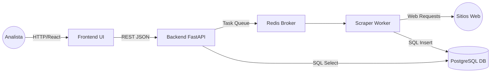
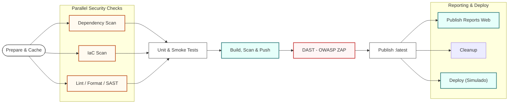

'[](https://github.com/MauricioVergaraG/proyecto-centinela/actions/workflows/ci-cd.yml)
# 🛡️ CENTINELA
**Plataforma de Análisis Forense y Detección de Desinformación**
*Cloud Computing | Ciberseguridad | DevSecOps | Grupo 3 – UNIMINUTO*

---


## 🧩 Resumen Ejecutivo

Centinela es una plataforma modular basada en microservicios diseñada para la detección, clasificación y análisis forense de desinformación (Fake News) usando técnicas de scraping, heurística de texto y flujos DevSecOps de seguridad continua.

Esta plataforma integra:

*   Microservicios aislados
*   Contenedores Docker
*   FastAPI como API Gateway
*   Scraping asíncrono con Workers
*   Persistencia forense en PostgreSQL
*   Pipeline CI/CD seguro (Shift-Left Security)
*   Dashboard en React + Tailwind con visualización SAST, sentimiento y riesgo

---

## 🏗️ Arquitectura del Sistema

El sistema se compone de 5 servicios totalmente desacoplados:



### Descripción de cada componente

| Componente     | Tecnología        | Función                                                     |
| :------------- | :---------------- | :---------------------------------------------------------- |
| **Frontend**   | React + Tailwind  | UI para búsquedas, dashboard y reportes                     |
| **Backend API**| FastAPI           | Endpoint seguro, validación de entradas, guarda registros   |
| **Broker**     | Redis Queue       | Orquestra trabajos asíncronos y evita bloqueos              |
| **Scraper Worker** | Python            | Extrae artículos, limpia HTML, clasifica y asigna riesgo/sentimiento |
| **Base de Datos**  | PostgreSQL        | Persistencia forense inmutable                              |

---

## 🚀 Pipeline DevSecOps (CI/CD)

La plataforma implementa un pipeline de seguridad integral basado en GitHub Actions, estructurado bajo el modelo Shift-Left Security.

### Diagrama del Pipeline



### Etapas del Pipeline

| Etapa | Herramientas | Analogía | ¿Qué hace técnicamente? | Objetivo |
| :--- | :--- | :--- | :--- | :--- |
| **1. Cache & Prep** | GitHub Cache | 🎒 **La mochila lista:** Preparar todo la noche anterior. | Guarda copias de las librerías descargadas para no bajarlas de internet cada vez. | Acelerar la ejecución del Pipeline. |
| **2. SAST** (Estático) | Black, Flake8, Bandit | 📝 **El profesor de lengua:** Revisa la ortografía antes de leer. | Lee tu código fuente línea por línea buscando errores de sintaxis o contraseñas escritas. | Detectar fallos de seguridad y estilo en tu propio código. |
| **3. SCA** (Composición) | Trivy (Filesystem) | 🥫 **Ingredientes vencidos:** Revisar las fechas de caducidad. | Analiza las librerías externas (`requirements.txt`) buscando vulnerabilidades conocidas. | Evitar usar piezas de software de terceros inseguras. |
| **4. IaC Security** | Checkov | 🏗️ **El Arquitecto:** Revisa los planos de la casa. | Escanea archivos de configuración (`Dockerfile`, Terraform) buscando malas prácticas. | Asegurar que la infraestructura no tenga puertas traseras. |
| **5. Testing** | Pytest | 🚗 **Encender el motor:** Ver si el coche arranca y frena. | Ejecuta funciones del código para verificar que la lógica matemática y de negocio funcione. | Validar que la aplicación hace lo que debe hacer. |
| **6. Container Security** | Trivy (Image) | 🩻 **Rayos X del Aeropuerto:** Escanear la maleta cerrada. | Analiza la imagen Docker final (Sistema Operativo + App) buscando fallos en el sistema base. | Asegurar el paquete final antes de enviarlo. |
| **7. DAST** (Dinámico) | OWASP ZAP | 🥷 **El Ladrón contratado:** Intentar entrar a la fuerza. | Ataca la aplicación mientras está funcionando (simula hackers reales). | Encontrar fallos que solo aparecen cuando la app está viva. |
| **8. Registry** | Docker Hub / GHCR | 🏦 **La Bóveda:** El estante seguro. | Almacena y certifica la imagen final que pasó todas las pruebas anteriores. | Tener un lugar centralizado y seguro para el despliegue. |
| **9. Reporting** | GitHub Pages | 📊 **El Tablero de Resultados:** Publicar las notas en la pared. | Toma los reportes HTML generados y los publica como un sitio web estático. | **Visibilidad:** Que los humanos puedan leer y auditar el estado de seguridad fácilmente. |

---

### 3. Ejecutar despliegue Local o desde imagenes de DockerHub

## 💻 Ejecución Local
Desde una terminal de Ubuntu 

1.  **Clonar el repositorio**
    ```bash
    git clone https://github.com/MauricioVergaraG/proyecto-centinela.git
    ```
2.  **Creer Arvivo de secretos .env**
    ```bash
    echo "NEWS_API_KEY=37b68e3eeb874755937384afbbc67cda" > .env
    ```

3.  **Despliegue local**
    ```bash
    docker compose -f docker-compose.prod.yml pull
    docker compose -f docker-compose.prod.yml up -d
    ```
4.  **Accesos y pruebas**
    *   **Frontend:** `http://localhost:3000`
    *   **API Docs (Swagger):** `http://localhost:8000/docs`

---
## 🐳 Ejecución desde Docker Hub (Despliegue Rápido)
Las imágenes oficiales del proyecto están certificadas y disponibles públicamente en Docker Hub. No es necesario clonar el código fuente para desplegar la solución en producción.

| Servicio         | Repositorio Docker Hub                  |
| :--------------- | :-------------------------------------- |
| **Frontend**     | `mauriciovergara/centinela-frontend`    |
| **API Backend**  | `mauriciovergara/centinela-api`         |
| **Scraper Worker** | `mauriciovergara/centinela-scraper`     |

### Cómo desplegar en Producción
Cree un archivo `docker-compose.prod.yml` en su servidor con el siguiente contenido para consumir la última versión estable:

```bash
       nano docker-compose.prod.yml
```
```yaml
version: '3.8'

services:
  frontend:
    image: mauriciovergara/centinela-frontend:latest
    ports: ["80:80"] # La app estará disponible en el puerto 80
    restart: always
    depends_on: [api]

  api:
    image: mauriciovergara/centinela-api:latest
    environment:
      - DATABASE_URL=postgresql://user:pass@db:5432/centinela
      - REDIS_HOST=redis
    depends_on: [db, redis]

  scraper:
    image: mauriciovergara/centinela-scraper:latest
    environment:
      - DATABASE_URL=postgresql://user:pass@db:5432/centinela
      - REDIS_HOST=redis
    depends_on: [api]

  db:
    image: postgres:15-alpine
    environment:
      POSTGRES_USER: user
      POSTGRES_PASSWORD: pass
      POSTGRES_DB: centinela
    volumes: [postgres_data:/var/lib/postgresql/data]

  redis:
    image: redis:7-alpine

volumes:
  postgres_data:
```

### Ejecutar Despliegue
Ejecute los siguientes comandos en la misma carpeta donde creó el archivo:

```bash
# 1. Descargar las últimas imágenes verificadas desde Docker Hub
docker compose -f docker-compose.prod.yml pull

# 2. Levantar el sistema en segundo plano
docker compose -f docker-compose.prod.yml up -d

# 3. Accesos y pruebas
Frontend: `http://localhost:3000`
API Docs (Swagger): `http://localhost:8000/docs`
```
---

## 🔍 Módulo de Análisis (Scraper + Heurística)

El motor de análisis aplica:

### 1. Limpieza y normalización
*   Eliminación de HTML
*   Decodificación de entidades
*   Tokenización

### 2. Análisis de riesgo
Se evalúan:
*   Porcentaje de palabras alarmistas
*   Presencia de MAYÚSCULAS excesivas
*   Frecuencia de términos manipulativos
*   Ausencia de fuentes verificables
*   Longitud irregular

La clasificación resultante puede ser:

| Nivel       | Criterio                          |
| :---------- | :-------------------------------- |
| **High Risk**   | Señales severas de manipulación     |
| **Medium Risk** | Inconsistencias moderadas         |
| **Low Risk**    | Información estable y verificable |

### 3. Análisis de sentimiento
Se asignan:
*   Positivo
*   Neutral
*   Negativo

---

## 📊 Dashboard de Análisis (Frontend)
Incluye:
*   Métricas agregadas
*   Sentimiento promedio
*   Clasificación de riesgo
*   Conteo total de artículos
*   Lista detallada de artículos
*   Enlaces directos a las fuentes originales

---

## 🛡️ Evidencia de Seguridad
Automáticamente generada en GitHub Actions:
*   `trivy-reports.zip`: Vulnerabilidades en contenedores y dependencias
*   `reporte-dast-zap.html`: Ataque OWASP ZAP completo
*   `semgrep-report.json`: Hallazgos SAST estructurados
*   `checkov-report.txt`: Validación IaC

---

## 👥 Créditos del Proyecto

**Proyecto Académico – Grupo 3**
*Corporación Universitaria Minuto de Dios – UNIMINUTO*
*Especialización en Ciberseguridad*

**Líder Técnico:** Mauricio Vergara

**Stack:** Python, FastAPI, React, Docker, Redis, PostgreSQL, GitHub Actions

© 2025 – Centinela Project

*Arquitectura segura, reproducible y diseñada bajo mejores prácticas DevSecOps.*

## 🎥 Video de Sustentación
Mira la demostración completa del ciclo DevSecOps y el despliegue en vivo:

[](https://www.youtube.com/watch?v=HkRN00mQ6EM)


